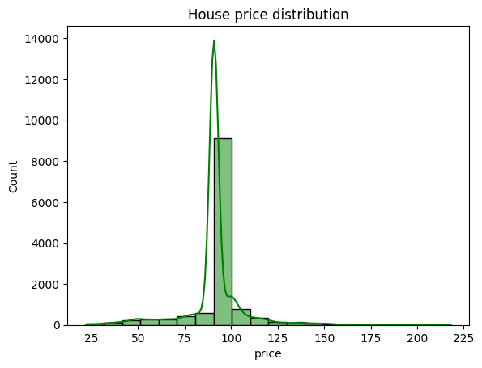
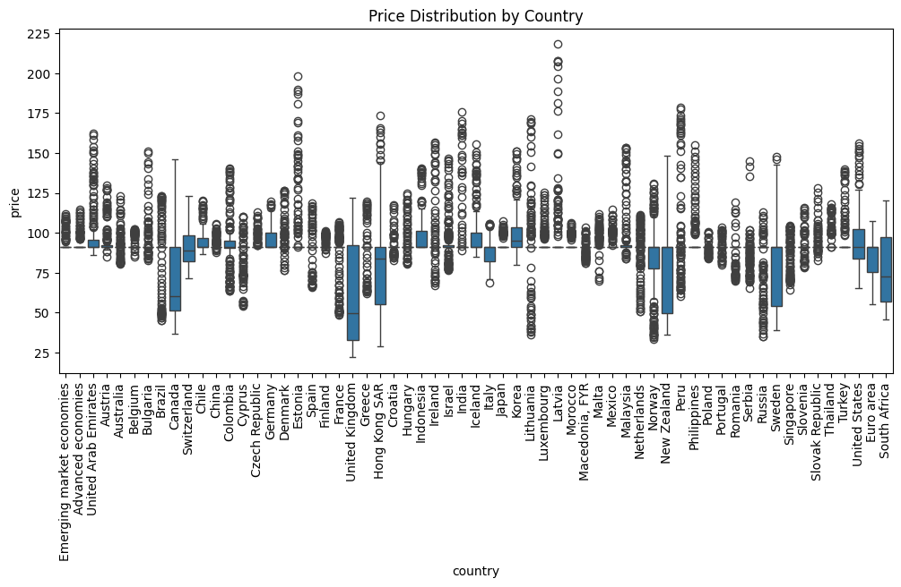
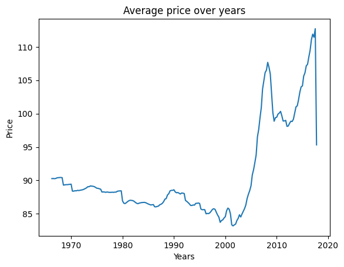

# House Price Dataset EDA report 

## Overview
- The dataset contains **12627 rows** and **3 columns**
- Missing values were handled as follow :
  - **Price** : filled with mean values

---

## Key Insights
- House prices are **right-skewed**, with most properties priced in the **lower range** and a small number of **high-priced** outliers, indicating the presence of premium or luxury properties.
- The dataset contains missing values only in the **price column**, while date and country have complete data, suggesting that price information may not be consistently reported.
- There is a significant variation in house prices across countries, with some countries showing higher median prices, indicating differences in real estate markets and economic conditions.
- The average house price shows noticeable fluctuations over time, suggesting that prices may be influenced by temporal factors such as market demand or seasonal trends.
----
## Visual Insights

- **House price distribution**

 

  

 

- **Price Distribution by Country**

 

  

 

- **Average price over years**

 

  

 

---

## Conclusion
The exploratory analysis reveals noticeable changes in house prices over time across different countries. Price levels vary significantly by country, and temporal trends suggest that housing prices are influenced by regional and time-based factors.