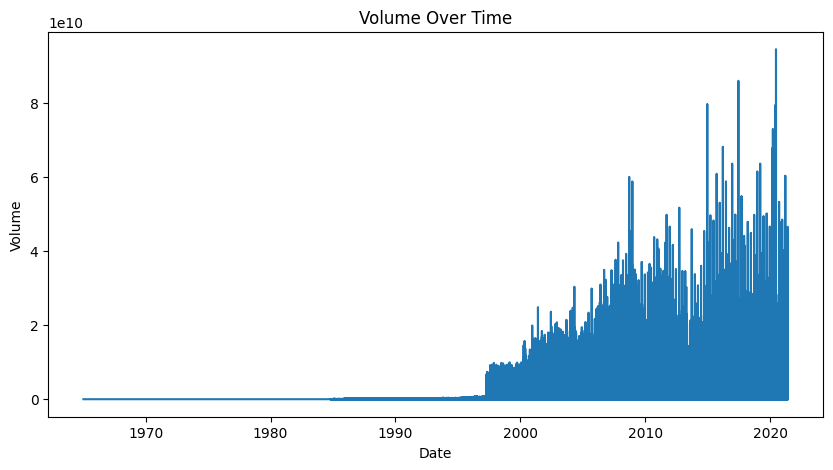
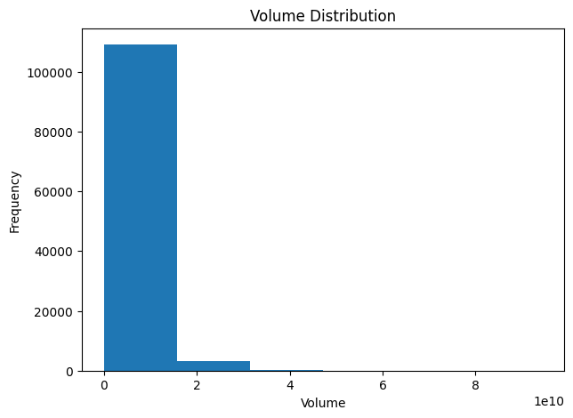
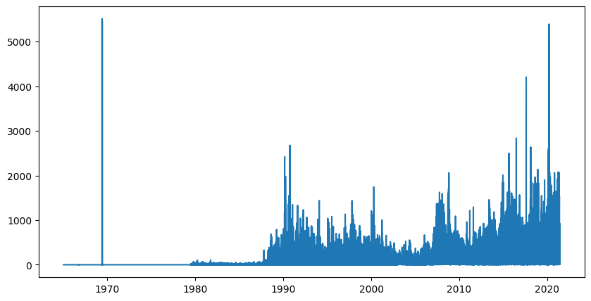

# Stock Market EDA Report 

### Overview
- The dataset contained **112457 rows** and **8 columns**.
- Missing values were handled as follows :
    - **Open, High, Low, Close, Adj Close, Volume** : filled with interpolation method
---
### Key Insights
- **Closing Trends** were upwards which means the stocks are in rising trend
- **Volatility** of the stocks were high as the difference between high and low is huge
- Stocks are highly active and popular as the **volume** is very high
---
### Visual Insights
- Closing Price Trends
 

  

 

- Stock Popularity and active rate
 

  

 
 

  

 
- Volatility
 

  

 

---

## Conclusion
The exploratory analysis reveals noticeable in stocks across different timelines. Closing price were upwards which meant rising trends in stock, the stocks are very active during the time period and stocks are highly volatile.