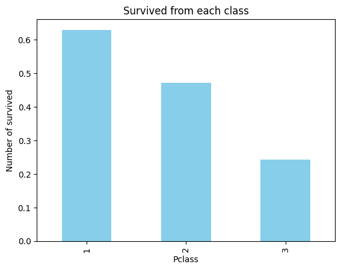
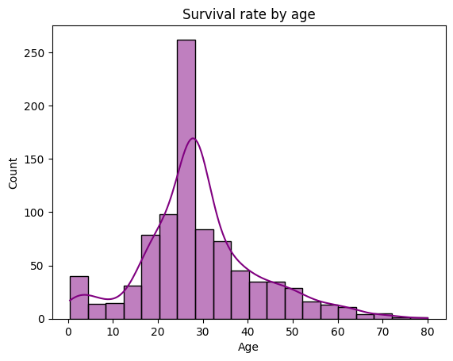
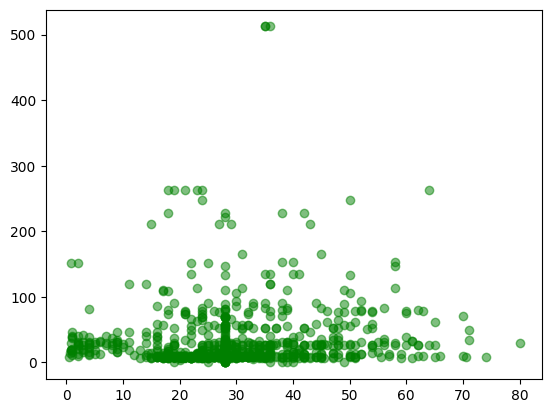

# Titanic Dataset – Exploratory Data Analysis (EDA)

## Overview
- The dataset contains **891 rows** and **12 columns**.
- Missing values were handled as follows:
  - **Age**: Filled with the **median** value.
  - **Embarked**: Filled with the **mode** (most frequent value).
  - **Cabin**: Dropped due to a large number of missing values.

---

## Key Insights
- Survival rates are highest for **first-class passengers (~62%)** and lowest for **third-class passengers (~24%)**.
- The majority of passengers fall within the **20–40 years** age group.
- A **positive correlation** exists between **Fare** and **Survival**.

---

## Visual Insights
- Passenger class vs survival visualizations show higher survival in premium classes.
 

  

 
- Age distribution plots indicate a concentration of young adult passengers.
 

  

 
- Fare-based plots suggest increased survival probability with higher fares.
 

  

## Conclusion
The analysis highlights the impact of **socio-economic status (Pclass & Fare)** and **age** on survival, forming a strong base for further **machine learning modeling**.
